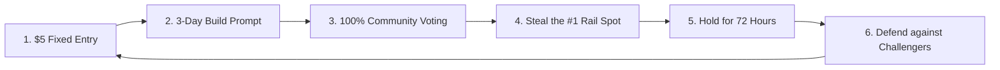

# 🚀 RankLancr.lol — Full System Architecture & Engineering Documentation

RankLancr.lol is a high-urgency, merit-first developer competition and portfolio arena designed with real-time viral mechanics inspired by *outbid.lol*. It pairs 100% transparent community voting with real-time contestable leaderboard placements.

---

## 📑 Table of Contents
1. [Core Philosophy & Game Loop](#1-core-philosophy--game-loop)
2. [Landing Page Narrative & UI Architecture](#2-landing-page-narrative--ui-architecture)
3. [Viral Live Features Breakdown](#3-viral-live-features-breakdown)
4. [Backend Engines & Real-time Subscriptions](#4-backend-engines--real-time-subscriptions)
5. [Database Architecture & Migrations](#5-database-architecture--migrations)
6. [Anti-Abuse & Quality Gate System](#6-anti-abuse--quality-gate-system)
7. [Monetization & Ascending Auction Model](#7-monetization--ascending-auction-model)
8. [Scale, Connection Limits & High-Traffic Monitoring](#8-scale-connection-limits--high-traffic-monitoring)
9. [UX Feedback, Error Handling & Mobile Responsiveness](#9-ux-feedback-error-handling--mobile-responsiveness)
10. [Complete File Directory & Component Map](#10-complete-file-directory--component-map)
11. [Running, Testing & Maintenance](#11-running-testing--maintenance)

---

## 1. Core Philosophy & Game Loop

RankLancr replaces static freelance resumes and pay-to-win job boards with a dynamic, skill-driven contest loop:



### Key Principles:
- **Zero Pay-to-Win**: Entry fee is strictly fixed at $5.00 USD. Money cannot buy challenge votes or rank positions.
- **Dynamic Leaderboard ("Steal the Rail")**: The #1 Top Developer Rail is not a static list; it can be challenged and overtaken in real time if another developer's verified submission surpasses the current holder's vote count.
- **Organic ProRank Independence**: Paid placements (such as Outbid Spotlight bidding or Challenge Sponsorships) are strictly isolated and never artificially inflate organic ProRank algorithm scores.

---

## 2. Landing Page Narrative & UI Architecture

The landing page (`src/pages/PixelpushLanding.tsx`) is organized as a single, high-conversion story designed to hook visitors in seconds:

```
┌─────────────────────────────────────────────────────────────┐
│ 1. HERO SECTION                                             │
│    "Submit your best work. Steal the #1 spot.               │
│     Get stolen tomorrow."                                   │
│    [🔴 LIVE ACTIVITY FEED TICKER]                           │
├─────────────────────────────────────────────────────────────┤
│ 2. STEAL THE RAIL CARD (Front & Center Main Hook)          │
│    • Current #1 Holder (Name, Title, Avatar, Votes)        │
│    • "X steal attempts today" Live Counter                  │
│    • "Held for 2h 14m" Live Timer                           │
│    • [ATTEMPT RAIL STEAL] Action Button                     │
├─────────────────────────────────────────────────────────────┤
│ 3. ACTIVE CHALLENGE & LIVE VOTE BATTLE                     │
│    • Head-to-head score bar duel (Top 1 vs Top 2)           │
│    • Live animated progress bars via CSS transitions        │
│    • Real-time countdown to voting cutoff                   │
├─────────────────────────────────────────────────────────────┤
│ 4. HOW IT WORKS (Condensed 3 Steps)                         │
│    • Step 1: Submit Best Work ($5 fixed entry)              │
│    • Step 2: Get Community Votes (100% Merit)               │
│    • Step 3: Steal the Rail (Hold 72h Flagship Placement)   │
├─────────────────────────────────────────────────────────────┤
│ 5. PRICING & GUARANTEES                                     │
│    • $5 Challenge Entry, Pro Rank Verified, Enterprise      │
├─────────────────────────────────────────────────────────────┤
│ 6. FAQ & FOOTER                                             │
└─────────────────────────────────────────────────────────────┘
```

---

## 3. Viral Live Features Breakdown

### A. Steal the Rail (`RailStealCard.tsx`)
- **Centerpiece Display**: Shows the reigning champion, their project title, and exact community vote count.
- **FOMO Counters**: Subscribed to `rail_steal_attempts` to display live count of people who tried to steal the rail today.
- **Hold Duration Timer**: Real-time timer computed from `rail_held_since`.
- **Interactive Steal Modal**: Allows logged-in users with active submissions to execute `attemptRailSteal()`.
- **Broadcast Animation**: Triggers a glowing border and flash animation across all active client browsers whenever a successful steal occurs.

### B. Live Vote Battle (`LiveVoteBattle.tsx`)
- **Head-to-Head Visuals**: Displays the top 2 competing projects in active voting with percentage split.
- **Smooth Animations**: Animated bar widths reacting instantly to Supabase `challenge_votes` inserts.
- **Empty State**: Displays an exact `"Next Live Vote Battle Drops Soon"` countdown timer when challenges are in draft or submission phases.

### C. Global Activity Feed Ticker (`ActivityFeedTicker.tsx`)
- **Live Pulse Dot**: Displays rotating events:
  - `🔴 Ahmed just stole the #1 Top Developer Rail (48 votes)`
  - `🟢 Elena cast a public vote for SaaS Landing Page`
  - `🚀 DevMarcus entered the $5 Skill Challenge Arena`
  - `🔥 Sarah claimed #1 Spotlight for $25 USD`
- **Relative Timestamps**: Formatted with `date-fns` (`formatDistanceToNow`).

### D. User-Specific Toast Broadcasts
- Subscribes to `supabase.channel('user:<userId>')`.
- If another developer overtakes your rail spot, an immediate error toast fires:
  > *"⚠️ Your Top Developer Rail spot was stolen by [Name]! Submit more work to reclaim #1!"*

---

## 4. Backend Engines & Real-time Subscriptions

### `railStealEngine.ts`
Located at `src/services/ranking/railStealEngine.ts`.
- **Eligibility Check**: Verifies `isSponsoredEligible(challengerProfile)` (must have rating >= 4.0 or new grace period, 0 active disputes, active standing).
- **Anti-Spam Cooldown**: 10-minute rate limit per user per submission (`checkRailStealRateLimit`) with human-readable `"Xm Ys remaining"` feedback.
- **Vote Validation**: Evaluates `challengerVoteCount > currentRailVoteCount`. Computes exact remaining votes needed on failure.
- **Persistence**:
  - Inserts all attempts into `rail_steal_attempts` (succeeded: true/false).
  - Inserts winning steals into `rail_steal_events`.
  - Updates `challenges` (`current_rail_holder_id`, `current_rail_vote_count`, `rail_held_since`).
  - Broadcasts `rail_stolen` event to the ousted developer's private channel.

### `spotlightEngine.ts`
Located at `src/services/ranking/spotlightEngine.ts`.
- **Ascending Auction Mechanics**: Minimum increment is `+5% or +$1.00 USD floor` (whichever is greater) to prevent 1-cent griefing.
- **72-Hour Hold**: Guarantees uninterrupted placement.
- **Price Decay**: Uncontested/expired slots decay 10%/day back toward the $5 base floor.

### `sponsorshipAuctionEngine.ts`
Located at `src/services/challenges/sponsorshipAuctionEngine.ts`.
- **Ascending Outbid Auction for Sponsors**: Starting floor bid is $100.00 USD (10,000 cents).
- **Dynamic Bidding Steps**: Enforces `+$25.00` minimum increment on lower price tiers and `+10%` on higher price bands.
- **Exclusive Co-Sponsorship**: The winning bidder claims exclusive co-sponsor branding and clickable link on the flagship Top Developer Rail.

---

## 5. Database Architecture & Migrations

### Single Migration File: `supabase/migrations/018_viral_live_features.sql`

```sql
-- 1. Challenges table enhancements
alter table challenges add column if not exists current_rail_holder_id uuid references profiles(id);
alter table challenges add column if not exists current_rail_vote_count int default 0;
alter table challenges add column if not exists rail_held_since timestamptz default now();

-- 2. Rail Steal Events (Successful Takeovers)
create table if not exists rail_steal_events (
  id uuid primary key default gen_random_uuid(),
  challenge_id uuid references challenges(id) on delete cascade,
  previous_holder_id uuid references profiles(id) on delete set null,
  new_holder_id uuid references profiles(id) on delete set null,
  submission_id uuid references challenge_submissions(id) on delete set null,
  stolen_at timestamptz default now(),
  vote_count_at_steal int not null
);

-- 3. Rail Steal Attempts (Public Attempt Counter)
create table if not exists rail_steal_attempts (
  id uuid primary key default gen_random_uuid(),
  challenge_id uuid references challenges(id) on delete cascade,
  attempted_by_id uuid references profiles(id) on delete set null,
  submission_id uuid references challenge_submissions(id) on delete set null,
  succeeded boolean not null default false,
  attempted_at timestamptz default now()
);

-- 4. Global Activity Feed
create table if not exists activity_feed (
  id uuid primary key default gen_random_uuid(),
  event_type text not null check (event_type in
    ('rail_steal', 'new_vote', 'new_entry', 'spotlight_outbid', 'challenge_won')),
  actor_id uuid references profiles(id) on delete set null,
  actor_display_name text not null,
  metadata jsonb default '{}',
  created_at timestamptz default now()
);

-- 5. Realtime Replication Publications
do $$
begin
  begin
    alter publication supabase_realtime add table rail_steal_events;
  exception when others then null;
  end;
  begin
    alter publication supabase_realtime add table rail_steal_attempts;
  exception when others then null;
  end;
  begin
    alter publication supabase_realtime add table activity_feed;
  exception when others then null;
  end;
  begin
    alter publication supabase_realtime add table challenge_votes;
  exception when others then null;
  end;
end $$;

-- 6. Trigger: Automatic Rail Steal Activity Feed Logging
create or replace function log_rail_steal_to_feed()
returns trigger as $$
declare
  v_display_name text;
begin
  select coalesce(p.display_name, p.name, 'Anonymous Challenger')
  into v_display_name
  from profiles p
  where p.id = new.new_holder_id;

  insert into activity_feed (event_type, actor_id, actor_display_name, metadata)
  values (
    'rail_steal',
    new.new_holder_id,
    coalesce(v_display_name, 'A Top Developer'),
    jsonb_build_object(
      'challenge_id', new.challenge_id,
      'previous_holder_id', new.previous_holder_id,
      'submission_id', new.submission_id,
      'vote_count', new.vote_count_at_steal
    )
  );
  return new;
end;
$$ language plpgsql;

create trigger trg_log_rail_steal
after insert on rail_steal_events
for each row execute function log_rail_steal_to_feed();
```

---

## 6. Anti-Abuse & Quality Gate System

Located at `src/services/ranking/antiAbuse.ts`:

1. **Quality Gate (`isSponsoredEligible`)**:
   - Account rating must be >= 4.0 (or < 3 reviews for new freelancer grace period).
   - Must have 0 unresolved dispute records.
   - Account standing cannot be `'flagged'` or `'suspended'`.
2. **Voting Anti-Bot Fingerprinting**:
   - Unique device/client hashing (`clientFingerprint`) preventing duplicate votes per challenge.
   - Burst frequency limits (max 5 votes/min per client identifier).
3. **Impression & Click Deduplication**:
   - 30-minute cooldown window on telemetry analytics.

---

## 7. Monetization & Ascending Auction Model

RankLancr uses an auction and merit-participation monetization model:

| Revenue Stream | Price Mechanism | Auction Type / Increment | Flagship Placement & Benefit |
|---|---|---|---|
| **Challenge Entry** | **$5.00 USD** (Fixed) | Fixed Flat Fee | Entry into 3-day skill prompt + eligible for #1 Top Developer Rail |
| **Outbid Spotlight** | **$5.00+ Ascending** | Outbid Auction (+5% or +$1.00 floor) | Guaranteed 72-hour placement in Top 3 Spotlight Slots |
| **Challenge Sponsorship** | **$100.00+ Ascending** | Outbid Auction (+10% or +$25.00 floor) | Exclusive Co-Sponsor logo watermark & direct link on Top Developer Rail |

---

## 8. Scale, Connection Limits & High-Traffic Monitoring

### Supabase Realtime Monitoring:
- **Free / Pro Tier Connection Limits**: Supabase Realtime has concurrent WebSocket connection limits (e.g. 500 concurrent connections on Free, 10,000 on Pro).
- **Traffic Spike Protocol**:
  1. Monitor **Supabase Dashboard $\rightarrow$ Realtime $\rightarrow$ Concurrent Connections**.
  2. If connection thresholds reach $>80\%$, migrate high-frequency broadcast channels (`ActivityFeedTicker` and `LiveVoteBattle`) to a dedicated WebSocket broadcaster like **Pusher** or **Ably**.
  3. Low-frequency, high-value transactions (`rail_steal_events`, `challenge_votes`) remain safely on Supabase Postgres Changes.

---

## 9. UX Feedback, Error Handling & Mobile Responsiveness

### A. Clear Feedback on Failed Steal Attempts
When a user clicks **[Attempt Steal]** and their submission has fewer votes than the current #1 holder:
- **Exact Vote Delta**: The system calculates the exact difference:
  > *"Steal failed: Your entry has 22 votes, but the #1 holder has 42 votes. You need 21 more votes to take the crown!"*
- **Public Counter Logging**: Even failed attempts are inserted into `rail_steal_attempts` with `succeeded = false`, visibly increasing the public *"X people tried today"* FOMO counter.

### B. Transparent Cooldown Messaging
When attempting repeated steals within the 10-minute anti-abuse cooldown:
> *"Cooldown active: Please wait 7m 24s before attempting another rail steal on this submission."*

### C. Mobile Responsiveness & Social Traffic
Because viral traffic from X/Twitter and Reddit is predominantly mobile:
- **Adaptive Layouts**: `RailStealCard` and `LiveVoteBattle` collapse into single-column, touch-optimized cards on mobile screens (`< 640px`).
- **Touch Targets**: Minimum 48px hit areas for all primary CTA buttons (`[ Attempt Steal ]`, `[ Cast Vote ]`, `[ Enter Arena ]`).
- **Font Scaling & Contrast**: Strict neo-brutalist styling with bold borders and high-contrast badges ensures readability on any mobile device.

---

## 10. Complete File Directory & Component Map

```
seo-rank-tracker/
├── api/                               # Serverless API routes (Paddle, Stripe, Challenges)
│   ├── challenges.ts                  # Challenge voting, entry & ranking API
│   ├── spotlight.ts                   # Spotlight slots & bidding endpoint
│   └── paddle-webhook.ts              # Paddle webhook handling
├── src/
│   ├── components/
│   │   ├── challenges/
│   │   │   ├── RailStealCard.tsx      # ⭐ #1 Contestable Rail card with live timers & steal button
│   │   │   ├── LiveVoteBattle.tsx     # ⭐ Head-to-head score bar duel & countdown
│   │   │   ├── TopDeveloperRail.tsx   # Merit 72h showcase rail
│   │   │   ├── ChallengeSection.tsx   # Active challenges list
│   │   │   ├── SponsorChallengeModal.tsx # Ascending outbid modal for sponsors
│   │   │   └── ChallengeSubmitModal.tsx
│   │   ├── pixelpush/
│   │   │   ├── Hero.tsx               # ⭐ New one-line hook & ActivityFeedTicker integration
│   │   │   ├── ActivityFeedTicker.tsx # ⭐ Real-time live event ticker
│   │   │   ├── HowItWorksCondensed.tsx# ⭐ 3-Step condensed explainer
│   │   │   ├── SpotlightSection.tsx   # Outbid ascending auction top 3
│   │   │   ├── Pricing.tsx            # Pricing tiers
│   │   │   ├── Faq.tsx                # Frequently asked questions
│   │   │   └── Navbar.tsx & Footer.tsx
│   ├── hooks/
│   │   └── useRealtimeChannel.ts      # ⭐ Supabase Realtime Postgres Changes & Broadcast hook
│   ├── pages/
│   │   ├── PixelpushLanding.tsx       # ⭐ Restructured landing page (6-part narrative)
│   │   ├── ChallengeArenaPage.tsx     # Full challenge details with LiveVoteBattle
│   │   └── PromotedRankingPage.tsx    # Dedicated Outbid Spotlight bidding page
│   └── services/
│       ├── challenges/
│       │   └── sponsorshipAuctionEngine.ts # Ascending auction engine for challenge sponsors
│       └── ranking/
│           ├── railStealEngine.ts     # ⭐ Rail takeover, vote checks, cooldowns & broadcast
│           ├── spotlightEngine.ts     # Ascending auction engine & decay
│           └── antiAbuse.ts           # Quality gates & fingerprinting
├── supabase/migrations/
│   └── 018_viral_live_features.sql    # ✅ Single sequential database migration
└── tests/
    ├── rail-steal-engine.test.ts      # ⭐ Unit test suite for Rail Steal Engine
    ├── spotlight-engine.test.ts       # Spotlight auction tests
    ├── sponsorship-auction.test.ts    # Sponsorship ascending auction tests
    └── challenge-winner-engine.test.ts# Deterministic tie-breaker & vote tests
```

---

## 11. Running, Testing & Maintenance

### Start Development Server
```bash
npm run dev
```
Accessible at: `http://localhost:5173/`

### Run Engine Test Suites
```bash
# Run Rail Steal Engine Tests
npx tsx tests/rail-steal-engine.test.ts

# Run Spotlight Engine Tests
npx tsx tests/spotlight-engine.test.ts

# Run Sponsorship Ascending Auction Tests
npx tsx tests/sponsorship-auction.test.ts

# Run Challenge Arena Merit Tests
npx tsx tests/challenge-winner-engine.test.ts
```

### Production Build Validation
```bash
npm run build
```

---
*Documentation compiled for RankLancr.lol — Merit-first Developer Arena.*
